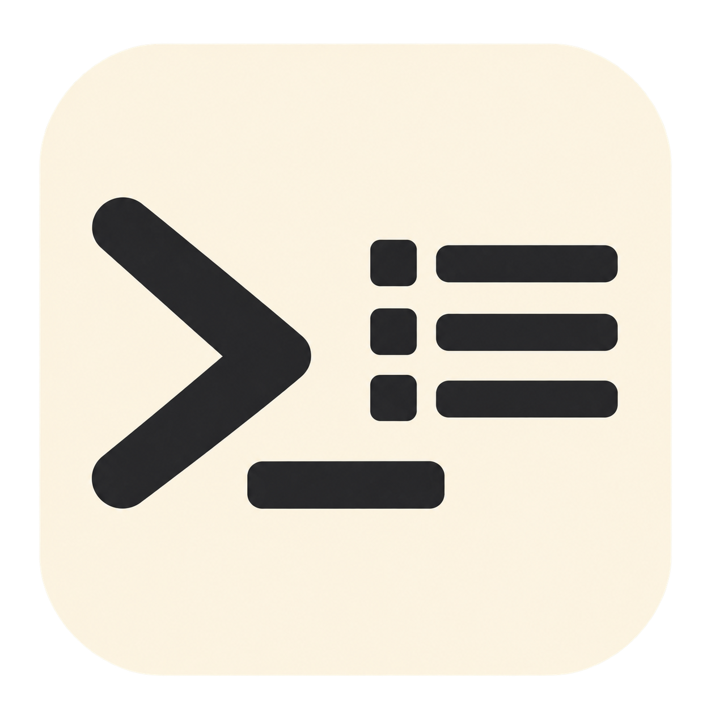

# Codex Model Monitor / Codex 模型监控器



[English](README.en.md) | 简体中文

在本地网页比较 Codex 发出的请求模型与服务端声明的响应模型。使用内部探针，仍由 Codex 直连服务，不需要代理或证书。此目录可单独复制使用，不依赖个人时区启动器或皮肤。

## 安装

当前支持 **Windows x64 的官方 Codex 桌面安装包（OpenAI.Codex）**。

1. 安装并登录官方 Codex 桌面版。
2. 安装 PowerShell **7.4+**、Python **3.10+**、Git、Rust（rustup），并确保 `pwsh`、`python`、`git`、`cargo` 可在终端运行。
3. 安装 Visual Studio Build Tools 的“使用 C++ 的桌面开发”工作负载，包含 MSVC x64 编译工具和 Windows SDK。
4. 将本目录保存到可写的本地目录。首次构建需联网、足够的磁盘空间和较长等待时间；Rust 工具链版本由对应官方源码指定。
5. 打开 Windows 的“编辑账户的环境变量”，在用户变量 `Path` 中新建一项，填入包含 `codex-monitor.cmd` 的文件夹完整路径（不是文件路径），保留原有条目。保存后重新打开终端，即可在任意目录使用 `codex-monitor` 命令。如果已安装其他同名命令，请先处理命令冲突，确保调用的是本目录中的启动器。

不需要 pip 或 npm 安装。发布目录不附带预编译后端、账号信息或运行日志。

## 使用

完成上述 PATH 配置并完全退出 Codex（包括托盘进程）后，在任意目录打开终端运行：

```powershell
codex-monitor -Desktop
```

启动器先检查桌面版所带后端版本；没有匹配缓存时，终端会显示 `Building probe backend ...`，下载对应官方源码、应用探针并编译。构建成功后启动原版 Codex 界面和监控网页，不修改时区、皮肤、官方安装文件或用户环境变量。后续启动复用匹配缓存；桌面版更新后重新构建。

网页默认地址为 `http://127.0.0.1:8765/`，每两秒刷新。使用页面的语言选项切换中文与英文。

```powershell
# 只查看已有日志，不启动或修改正在运行的 Codex
codex-monitor

# 换端口，且不自动打开浏览器
codex-monitor -Desktop -Port 8766 -NoBrowser
```

如果 PowerShell 执行策略阻止已下载的脚本，请先审阅文件并按本机或组织的策略解除限制。

`Ctrl+C` 停止网页服务；Codex 独立运行。恢复普通后端时，完全退出检测版 Codex，再从官方快捷方式启动。普通启动不会生成新的探针日志。

## 注意事项

运行 `codex-monitor -Cache` 打开终端缓存设置：输入 `K` 保留编译缓存以加速更新，输入 `R` 不保留（默认），输入 `C` 取消。选择不保留后，可输入 `N` 立即删除现有编译缓存，或输入 `L` 留待下次成功构建或复用后端时清理。不会删除可运行后端、源码仓库或调用日志；立即删除前请停止构建。

选择保存在项目根目录 `.monitor-settings.json`，已被 Git 忽略；选择保留时跳过下述编译缓存自动清理。`-Cache` 独立使用，不启动 Codex 或网页。

- 比较的是请求模型名称与服务端声明的 `response.model`（其次为 `openai-model` 响应头），不是服务端实际执行权重的证明。名称不同不等于已证明降级；任一模型缺失时显示未知。
- 用途来自本地任务和回合元数据，支持主任务、分支对话、子代理和后台辅助等分类；证据不足时保留未知。官方日志格式变化可能影响分类。
- 日志留在本目录 `logs/`。每日 SQLite 归档仅保存请求模型、响应模型、时间、一致性状态、用途；原始探针还含用于关联的任务、回合和调用标识，不记录提示词、回答正文或认证令牌。读取官方元数据时不会修改 `.codex`。
- 每日归档按 **UTC+8** 分日，保留最新 **15 个有记录的日期**，旧日期按顺序清理；网页时间按浏览器本地时区显示。因此网页日期可能与归档文件名不同。
- `output/probes/` 只留一个可运行探针版本，新版成功后替换旧缓存。成功构建或确认可复用后端后，自动清理 `output/target/` 和旧的 `upstream/codex-rs/target/` 编译缓存，保留可运行后端；下次更新需要完整重新编译，耗时可能增加。构建失败时不清理编译缓存。手动清理生成文件前先退出检测版 Codex 和监控服务。
- 官方同版本源码尚未发布、补丁不兼容或构建失败时会停止启动，不使用不匹配的旧版。检查终端错误后再重试。启动提示的 `-monitor` 只是显示标签，不修改内置版本或认证字段。
- 网页仅监听本机回环地址，不要将端口转发到公网。分享项目时不要包含 `logs/`、`output/` 或 `upstream/`；这些目录已被 `.gitignore` 排除。
- 本工具是非官方本地修改，无法保证未来桌面版本兼容。不要在存在未完成任务时切换后端。

## 验证源码

```powershell
python -B -m unittest test_monitor.py
pwsh -NoProfile -File .\test_build_probe.ps1
```

第二条需要已安装 Codex，会在 `output/desktop/` 产生版本检查副本，但不会构建探针或启动桌面应用。
